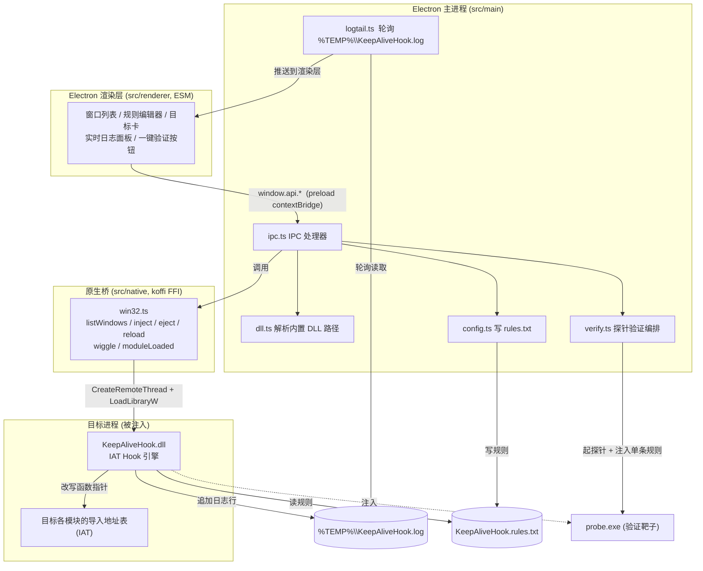
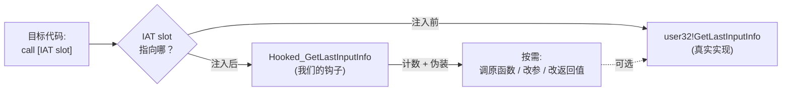
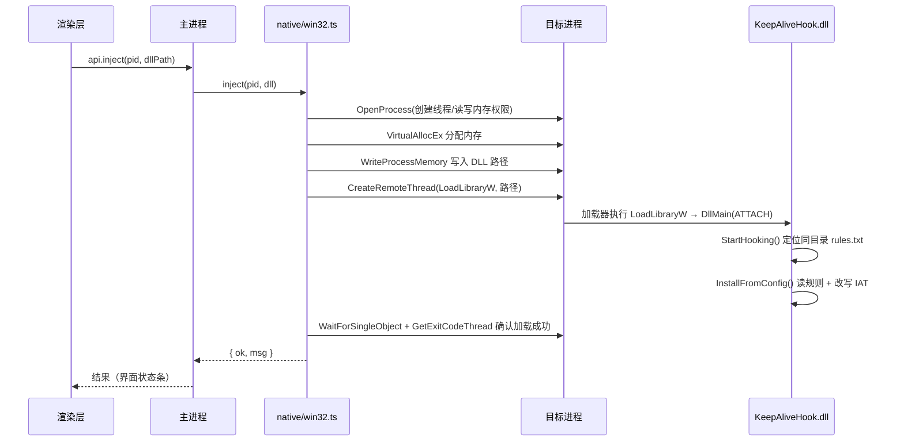
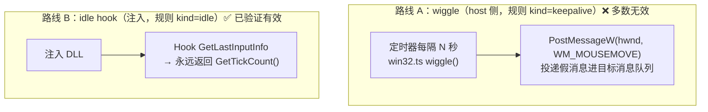
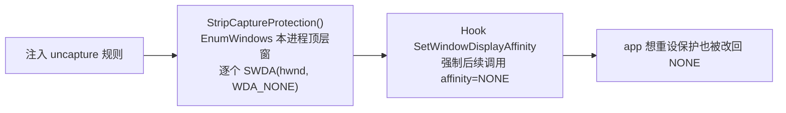

# de-anti-capture 整体架构与拦截原理

> 一个 Windows 桌面工具：通过 **DLL 注入 + IAT Hook**，对目标进程的 Win32 API 调用做拦截/伪装，实现
> **保活（防空闲）**、**前台伪装（防云电脑掉线）**、**剥离截屏保护（防录屏黑屏）** 以及**通用入参/返回值改写**。
> 配套**实时拦截日志、命中计数、一键验证探针**，让“拦截是否生效”可观测、可自证。

本文目标：一张图看懂整体结构 + 讲清完整拦截链路（注入→挂钩→命中→热重载→卸载），并**重点说明保活为什么会失效、正确的做法是什么**。

---

## 目录

1. [总体架构](#1-总体架构)
2. [进程模型与四层职责](#2-进程模型与四层职责)
3. [核心拦截原理：IAT Hook](#3-核心拦截原理iat-hook)
4. [完整拦截链路（注入 / 挂钩 / 命中 / 热重载 / 卸载）](#4-完整拦截链路)
5. [四种拦截能力详解](#5-四种拦截能力详解)
6. [保活（防休眠）专题 —— 为什么会“没生效”](#6-保活防休眠专题--为什么会没生效)
7. [防截屏拦截专题](#7-防截屏拦截专题)
8. [命中计数与一键验证体系](#8-命中计数与一键验证体系)
9. [配置文件 rules.txt 格式](#9-配置文件-rulestxt-格式)
10. [参考资料（prior art）](#10-参考资料prior-art)

---

## 1. 总体架构



**一句话数据流**：界面改规则 → 主进程写 `rules.txt` → 注入 DLL 进目标 → DLL 读规则、改写目标 IAT 里的函数指针 →
目标调 API 时落到我们的钩子（计数 + 伪装）→ 钩子节流把命中数写进日志 → 主进程轮询日志 → 界面实时显示挂钩/命中状态。

---

## 2. 进程模型与四层职责

| 层 | 位置 | 运行环境 | 职责 |
|---|---|---|---|
| **渲染层** | `src/renderer/` | Chromium 沙箱、无 Node | 全部 UI；通过 `window.api`（preload 暴露）发起所有操作；解析日志渲染状态徽章/命中数 |
| **主进程** | `src/main/` | Node | IPC 路由、解析内置 DLL、写 `rules.txt`、注入/卸载编排、验证探针编排、轮询日志回推 |
| **原生桥** | `src/native/win32.ts` | Node + koffi(FFI) | 用 koffi 调 `user32/kernel32`：枚举窗口、注入/卸载/热重载、PostMessage 保活、查模块是否已加载 |
| **拦截 DLL** | `HookDll/*.cpp` → `bin/KeepAliveHook.dll` | **目标进程内** | 真正的 IAT Hook 引擎：读规则、改写导入表、伪装 API、命中计数、热重载/还原 |

> 渲染层与 Node 完全隔离（`contextIsolation`），只能经 preload 的 [`window.api`](../src/preload.ts) 这 20 个白名单方法与主进程通信——这是 Electron 官方 process-model 的安全边界。

---

## 3. 核心拦截原理：IAT Hook

### 什么是 IAT
PE 可执行文件/DLL 调用外部函数（如 `user32!GetLastInputInfo`）时，并不是直接硬编码地址，而是经过本模块的
**导入地址表（Import Address Table, IAT）**——一张“函数名 → 运行时真实地址”的指针表，由加载器在加载时填好。
模块里每一处 `call GetLastInputInfo` 实际是 `call [IAT 中那一格]`。

### 我们做什么
**把 IAT 里那一格的指针，从“真实 user32 地址”改写成“我们钩子的地址”。** 之后目标每次调用都会跳进我们的代码。
原始指针被记下来，卸载时原样写回即可干净还原。



### 关键实现点（`HookDll/hooks.cpp`）
- **遍历全部模块**：`CreateToolhelp32Snapshot(TH32CS_SNAPMODULE)` 枚举目标进程已加载的每个模块，逐个改它们的 IAT
  （[`ApplyRuleAllModules`](../HookDll/hooks.cpp)）。因为调用方可能是 exe 本体，也可能是某个子 DLL，得全打一遍。
- **定位并改写槽位**：解析每个模块的 PE 导入目录，按 `dll!func` 名字匹配到那一格，用 SEH 保护下 `VirtualProtect` 改可写、
  写入新指针、记录原值（[`PatchModuleFunc` / `WriteSlot`](../HookDll/hooks.cpp)）。
- **动态生成机器码桩（stub）**：通用 `hook/ret` 规则不止换地址，还要“改入参寄存器 → 调原函数（尾跳）/ 不调直接返回 mock /
  调后改返回值”。这段逻辑用 x64 机器码即时拼出来（[`MakeStub`](../HookDll/hooks.cpp)），分配可执行内存后让 IAT 指向它。
- **IAT Hook vs Inline Hook**：本项目用 IAT Hook（只改导入表指针，不动函数体），比改写函数前几字节的 inline hook 更稳、易还原、
  不易被完整性校验发现。**代价**：只能拦到“通过导入表静态调用”的路径；若目标用 `GetProcAddress` 动态取址再调，IAT 里没有那一格，
  就拦不到（这也是验证里出现“已注入但 0 处命中”的根因）。

---

## 4. 完整拦截链路

### 4.1 注入（inject）



注入用的是最经典稳健的 **`CreateRemoteThread` + `LoadLibraryW`** 手法（`src/native/win32.ts` 的 `inject()`）：在目标进程里起一个
远程线程直接调 `LoadLibraryW("KeepAliveHook.dll")`，DLL 的 `DllMain` 一旦被加载就自动 `StartHooking`。

### 4.2 挂钩（InstallFromConfig）
DLL 读取**同目录**的 `KeepAliveHook.rules.txt`（每行一条规则），对 `pid` 匹配本进程（或 `pid=0` 全局）的启用规则逐条安装：
按 `kind` 选钩子目标（见 [第 5 节](#5-四种拦截能力详解)），然后 `ApplyRuleAllModules` 把目标进程所有模块的 IAT 都改一遍。
无配置文件时，**默认装一条 `idle` 保活拦截**，保证“注入即生效”。

### 4.3 命中与上报
每个钩子入口先调 `OnHookHit(idx)`：`InterlockedIncrement64` 累加该规则命中数，再 `MaybeReport()` **节流（≥1.2s）**地把有变化的
计数写成 `STAT kind=.. dll=.. func=.. hits=..` 日志行。**全程不开独立线程**——计数与上报都跑在“被钩函数自己的线程”上，从根本上
规避“后台线程在 DLL 卸载瞬间访问已释放内存”的崩溃竞争。

### 4.4 热重载（reload / ReloadHooks）
界面改了规则不必重新注入：主进程解析 DLL 的导出表拿到 `ReloadHooks` 的 RVA，`CreateRemoteThread` 调它 →
`RestoreAll()`（先停计数、还原所有 IAT 槽、释放 stub）后重新 `InstallFromConfig()`。

### 4.5 卸载（eject）
`CreateRemoteThread` 调 `FreeLibrary(模块基址)` → `DllMain(DETACH)` → `StopHooking` → `RestoreAll`：把记录过的每个 IAT 槽位
原样写回真实地址、释放生成的 stub 内存、计数清零。**目标进程干净恢复原状，无残留。**

---

## 5. 四种拦截能力详解

| kind | 拦的 API | 做法 | 用途 |
|---|---|---|---|
| **idle** | `GetLastInputInfo` | 钩子直接把 `plii->dwTime = GetTickCount()` 返回 TRUE | **保活**：让 app 永远以为“刚刚有输入”，不进空闲 |
| **fg** | `GetForegroundWindow` | 钩子返回**本进程自己的主窗口**（缓存，失效才重找） | **防云电脑/远程桌面掉线**：骗客户端“我一直在前台” |
| **uncapture** | `SetWindowDisplayAffinity` | ①主动对本进程所有顶层窗口调 `SWDA(hwnd, WDA_NONE)` 剥离已生效的保护 ②再 hook 住，强制后续调用都落到 `WDA_NONE` | **防录屏黑屏**：撕掉 `WDA_EXCLUDEFROMCAPTURE` |
| **hook / ret** | 任意 `dll!func` | 生成机器码 stub：可改 `rcx/rdx/r8/r9` 入参、可“不调原函数直接返回常量”、可“调原函数后改返回值” | **通用**：对付各种检测类 API（返回 BOOL/句柄/状态码） |

> `fg` 钩子有个重要的**作用域裁剪**（`SkipModuleForFg`）：跳过 Qt/Flutter/CEF/OpenGL/D3D 等 UI 框架模块与系统目录 DLL，
> 只在目标自身的 exe/SDK 里改 `GetForegroundWindow`——否则会搞乱 Qt 的窗口/焦点管理，注入后冒出一个点不动的白屏窗口（实测踩坑）。

---

## 6. 保活（防休眠）专题 —— 为什么会“没生效”

这是当前最容易踩坑、也是用户反馈“防休眠没生效”的核心。结论先行：

> **`PostMessage(WM_MOUSEMOVE)` 这条保活路线，对绝大多数“空闲检测/系统休眠”根本无效。**

### 6.1 现状有两条独立的保活路线



### 6.2 为什么路线 A（PostMessage）不生效
Windows 的“最后输入时间”由内核的 **Raw Input Thread (RIT)** 维护。`GetLastInputInfo`、屏保计时、息屏/睡眠计时，
**全都读 RIT 这个时间戳**。而：

- `PostMessage(WM_MOUSEMOVE)` 只是把一条**合成消息**塞进某个线程的消息队列，**根本不经过 RIT**——`dwTime` 不会更新。
- 低级钩子 `WH_MOUSE_LL/WH_KEYBOARD_LL`、原始输入 `WM_INPUT` 也只认**真实设备输入或 `SendInput` 注入的输入**，看不到投递的消息。
- 所以 `PostMessage(WM_MOUSEMOVE)` 只能触达“目标 wndproc 里**专门处理** WM_MOUSEMOVE 的代码”（悬停效果之类）。
  多数 app 的空闲判定根本不在那条路上——于是**等于什么都没做**。

> 网上常见的“PowerShell 定时移动鼠标却防不住息屏”就是同一回事：不走 RIT 的假移动，不重置空闲计时。

### 6.3 正确的三层方案（按侵入性从低到高）

| 方案 | 机制 | 作用范围 | 侵入性 | 适用 |
|---|---|---|---|---|
| **① 注入 idle hook**（已支持，规则 kind=idle） | Hook 目标 `GetLastInputInfo` 返回当前 tick | **单个 app** | 无（只骗这一个进程） | app 因自身空闲检测而暂停/登出/掉线 |
| **② 系统级 StayAwake**（已支持，底部开关） | `SetThreadExecutionState(ES_CONTINUOUS\|ES_SYSTEM_REQUIRED\|ES_DISPLAY_REQUIRED)` | **整机 + 显示器** | 无（不动鼠标，不改电源计划） | 防整机睡眠/息屏（演示、长任务、看板） |
| **③ 全局真实输入**（已支持，底部开关） | `SendInput` 发真实相对微移(+1/−1 净零) 或无害按键(VK_F15) | **全局所有 app** | 有（会动真实光标，轻微抖动） | app 用 LL hook/raw input 检测，或无法注入时的兜底 |

> **②③ 已落地为底部操作栏的两个开关**（host 侧、无需注入）：「系统级防休眠（不息屏/不睡眠）」→ `systemAwake`(SetThreadExecutionState)；
> 「真实输入心跳」→ 定时 `synthInput`(SendInput，可选 F15 按键 / 鼠标 ±1px 微移 / 两者)。实测 SendInput 把未注入探针读到的真实
> 全局空闲从 `1672ms → 0ms`——这正是 ① 路线的 `PostMessage` 做不到的。代码见 `src/native/win32.ts` 的 `systemAwake/synthInput`、
> 渲染层 `src/renderer/hooks/useAntiSleep.ts`。

要点辨析：
- **① 最干净**：非侵入、只影响目标进程，且已被一键验证证明有效（空闲 `73406ms → 0`）。**首选**。
  可进一步加 hook `GetTickCount/GetTickCount64`，覆盖“用 tick 差值算空闲”的 app。
- **② 是“防整机休眠”的标准答案**（PowerToys Awake / Caffeine 同款思路；前者起后台线程声明机器状态，后者每分钟敲一次键）。
  它**不重置 app 内部的空闲计数**，纯粹让 PC 和显示器别睡。注意它**挡不住用户主动睡眠/锁屏**。
- **③ 是用户要的“主动给键盘/鼠标输入”**：`SendInput` 会更新 RIT 全局时间戳，于是重置所有 app 的空闲、击退屏保/睡眠，
  也能被 LL hook/raw input 感知——这是唯一“看起来像真人操作”的路线。代价是**全局**（动真光标），所以做成“+1 像素再−1 像素净零”
  或发一个谁都不用的 `VK_F15`，把干扰降到最低。

> **决策建议**：
> - 只是某个 app 空闲掉线 → 用 **①注入 idle hook**（已支持，最优）。
> - 整机/显示器会睡 → 加 **②SetThreadExecutionState**（最该补的“其它更好方法”）。
> - app 走低级钩子/原始输入，或不便注入 → 上 **③SendInput** 真输入兜底。

---

## 7. 防截屏拦截专题

`SetWindowDisplayAffinity(hwnd, WDA_EXCLUDEFROMCAPTURE)` 让窗口在截屏/录屏里变黑（DWM 在所有捕获面里排除它）。
它**通常在窗口创建时只调一次**，事后没有“调用”可拦——所以**光 hook 没用**，必须**主动剥离已生效的保护**：



- **主动剥离**：`StripCaptureProtection` 枚举本进程所有顶层窗口（该 API 只对顶层窗有效），逐个调真实 `SWDA(hwnd, 0)` 撕掉黑屏保护。
- **再 hook 防重设**：`Hooked_SetWindowDisplayAffinity` 不管 app 传什么都强制 `WDA_NONE` 再调原函数，防止它之后又把保护加回来。
- **白名单**：无影安全剪贴板叠加窗 `ClipSDK` 放行原值——剥它反而会变成白色遮挡（实测踩坑）。

> 业界其它绕过路线（仅作原理对照，本项目用的是上面的 userland strip+hook）：DKOM 内核读写改窗口对象、DWM hook（需 PPL 绕过）、
> 直接读 GPU 帧缓冲。各有侵入性/权限/可检测性的权衡，见[参考](#10-参考资料prior-art)。

---

## 8. 命中计数与一键验证体系

**这套是为了让“拦截到底生效没”可观测、可自证**，分三档（详见 `docs` 内调试相关说明与 `src/main/verify.ts`）：

- **Tier 1 实时日志 + 挂钩徽章**：主进程轮询 `%TEMP%\KeepAliveHook.log`，渲染层解析出 `rule[..] -> N slot(s)`，规则卡显示
  `✓ 已挂 N` / `✗ 0 处`（0 处 = 已注入但 IAT 里没有那一格，即动态取址或名字不符）。
- **Tier 2 命中计数 + 观察模式**：钩子入口 `OnHookHit` 累加，节流写 `STAT ... hits=M`，徽章追加 `· 命中 M`；
  开“全量观察(logall)”后，对一组检测类 API（`GetForegroundWindow/GetLastInputInfo/IsDebuggerPresent/...`）装**透传计数钩子**，
  看目标到底在探什么、探多频。
- **Tier 3 探针靶子 + 一键验证**：`probe.exe` 每 400ms 打印可观测量 `PROBE idle=.. fgself=.. aff=0x.. sm0=.. dbg=..`；
  每条规则的「验证」按钮会**起探针 → 取基线 → 只注入这一条（指向探针 pid）→ 取注入后 → 判定 → 卸载 → 还原配置**，
  直接给出“注入前 → 注入后”的彩色结论。实测 4 类均通过：
  `idle 73406→0`、`fg 0→1`、`uncapture 0x11→0`、`hook(ret=999) sm0 2560→999`。

---

## 9. 配置文件 rules.txt 格式

DLL 读取**与自身同目录**的 `KeepAliveHook.rules.txt`，每行：

```
pid | kind | enabled | dll | func | spec | name
```

- `pid`：目标进程 id（`0` = 不限进程，全局生效）。
- `kind`：`idle` | `fg` | `uncapture` | `hook` | `ret`(旧) | `logall`(观察开关) | `obs`(观察钩子，内部合成)。
- `enabled`：`1`/`0`。
- `dll!func`：被钩函数，如 `user32.dll` / `GetLastInputInfo`。
- `spec`（仅 `hook`）：分号键值，**只写出现的键才生效**——`call=0/1`（是否调原函数）、`a0..a3=值`（覆盖 rcx/rdx/r8/r9 入参）、`ret=值`（覆盖返回值）。
- 注释行以 `#` 开头；字段以 `|` 切分（UTF-8 续字节里不会出现 `|`，按字节切安全）。

例：让 `GetSystemMetrics` 完全拦截并返回 999 → `1234|hook|1|user32.dll|GetSystemMetrics|call=0;ret=999|演示`。

---

## 10. 参考资料（prior art）

**空闲检测 / 保活 / 鼠标 jiggler**
- [GetLastInputInfo function — Microsoft Learn](https://learn.microsoft.com/en-us/windows/win32/api/winuser/nf-winuser-getlastinputinfo)
- [PowerShell Mouse Move Not Preventing Windows Idle Mode? — codegenes.net](https://www.codegenes.net/blog/powershell-mouse-move-does-not-prevent-idle-mode/)（实证“假移动不重置空闲”）
- [WM_MOUSEMOVE message — Microsoft Learn](https://learn.microsoft.com/en-us/windows/win32/inputdev/wm-mousemove)

**系统级防睡眠**
- [SetThreadExecutionState function — Microsoft Learn](https://learn.microsoft.com/en-us/windows/win32/api/winbase/nf-winbase-setthreadexecutionstate)
- [System Sleep Criteria — Microsoft Learn](https://learn.microsoft.com/en-us/windows/win32/power/system-sleep-criteria)
- [PowerToys Awake — Microsoft Learn](https://learn.microsoft.com/en-us/windows/powertoys/awake)
- [Caffeine（每分钟敲一次键的极简实现）— GitHub](https://github.com/kyleleong/caffeine)

**截屏保护与绕过（SetWindowDisplayAffinity / WDA_EXCLUDEFROMCAPTURE）**
- [SetWindowDisplayAffinity function — Microsoft Learn](https://learn.microsoft.com/en-us/windows/win32/api/winuser/nf-winuser-setwindowdisplayaffinity)
- [How to Exclude Your Windows App from Screen Capture and Recall — Meziantou's blog](https://www.meziantou.net/how-to-exclude-your-windows-app-from-screen-capture-and-recall.htm)
- [SetWindowDisplayAffinity-Bypass（多种绕过路线对照）— GitHub](https://github.com/TopSoftdeveloper/SetWindowDisplayAffinity-Bypass)

---

*本文随代码演进维护；涉及具体实现处给出了 `HookDll/hooks.cpp`、`src/native/win32.ts`、`src/main/verify.ts` 等源码位置，便于对照。*
